<div align="center">

# 🛍️ AgentCore Customer Support Agent

**A production-shaped AI support agent on Amazon Bedrock AgentCore** — it tracks orders, processes refunds,
answers policy questions from a knowledge base, remembers customers across sessions, does exact loyalty
maths in a sandbox, and browses the web. Built with MCP tool integration, managed RAG, and defensive engineering.

[](https://github.com/mahmoudnasser1561/agentcore-customer-support-agent/actions/workflows/ci.yml)


| 🧠 **9 tools** | 🔌 **MCP Gateway** | 📚 **Managed RAG** | 🧬 **Cross-session memory** | 🧮 **Sandboxed maths** | 🌐 **Live browsing** | 🛡️ **Graceful degradation** |
|:-:|:-:|:-:|:-:|:-:|:-:|:-:|
| 3 local + 6 via Gateway | API + Lambda targets | Bedrock Knowledge Base | facts + preferences | Code Interpreter | AgentCore Browser | keeps working when a backend is down |

</div>

---

## 🏗️ Architecture at a glance

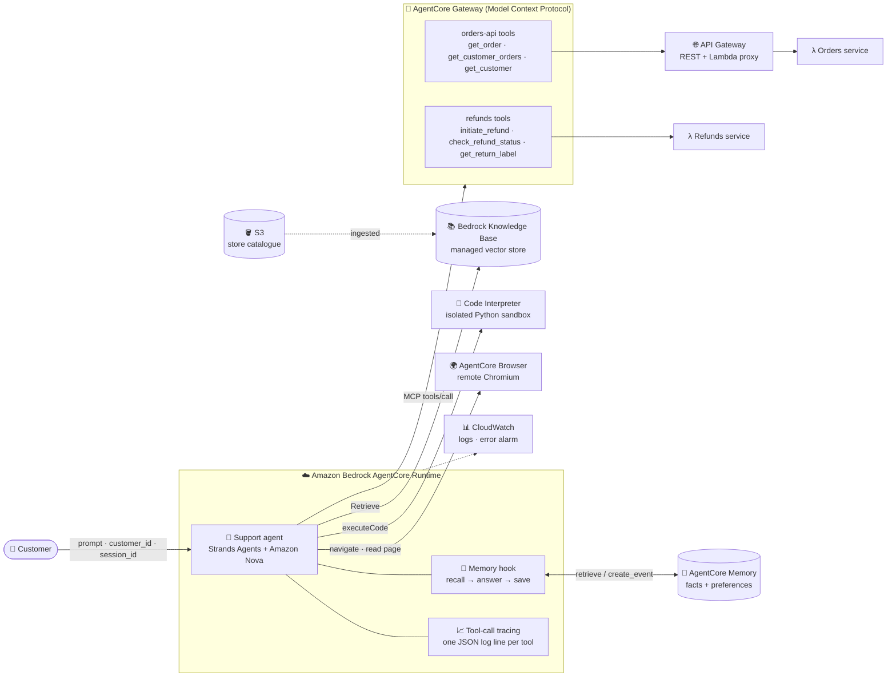

> **The idea in one sentence:** the model never *knows* anything about your customers or policies — it *asks*
> the right system (Gateway, knowledge base, memory, sandbox, browser) and stays grounded in what comes back.

---

## 🎬 What it does — six verified scenarios

Captured from the agent **deployed on AgentCore Runtime** (`agentcore invoke …`). AWS account identifiers are redacted.

<table>
<tr>
<td width="50%" valign="top">

**1 · Order tracking** — *Gateway → API Gateway → Lambda*
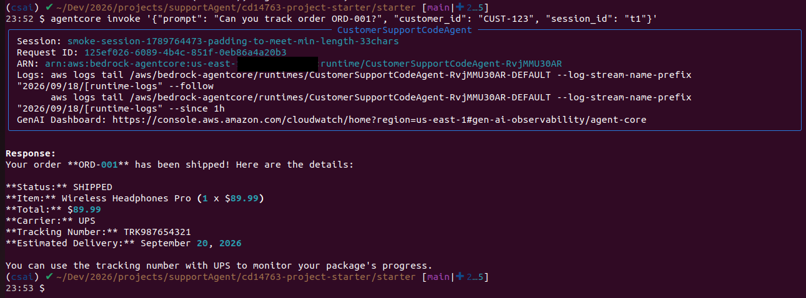

</td>
<td width="50%" valign="top">

**2 · Refund processing** — *Gateway → Lambda target*
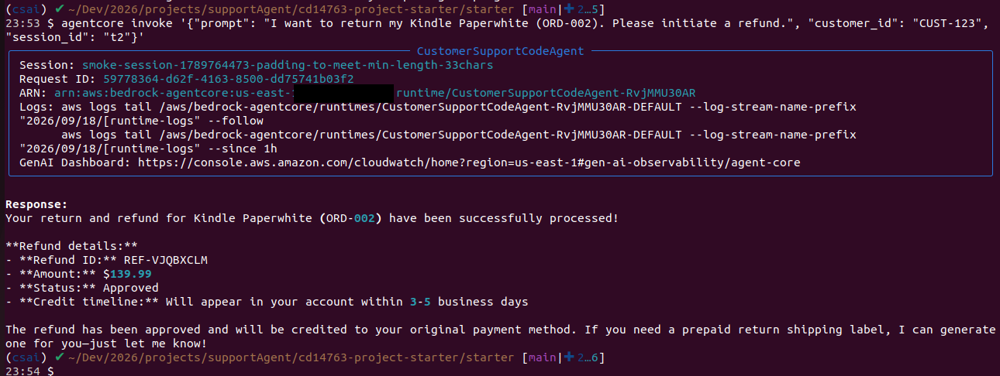

</td>
</tr>
<tr>
<td valign="top">

**3 · Policy answers (RAG)** — *Bedrock Knowledge Base*
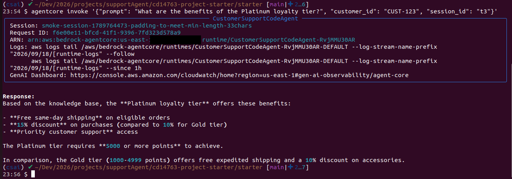

</td>
<td valign="top">

**4 · Cross-session memory** — *same customer, two sessions*
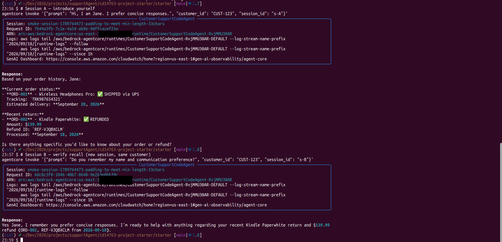

</td>
</tr>
<tr>
<td valign="top">

**5 · Exact loyalty maths** — *Code Interpreter sandbox*
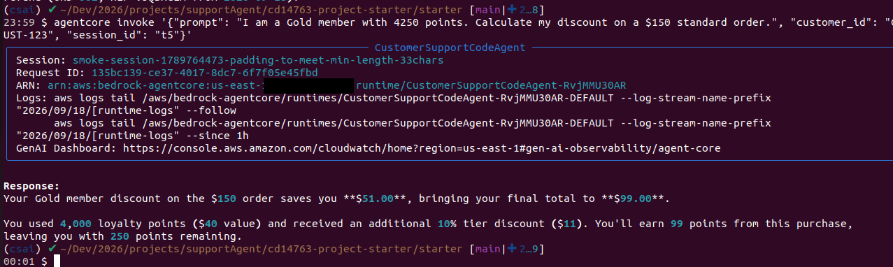

</td>
<td valign="top">

**6 · Live web browsing** — *AgentCore Browser*
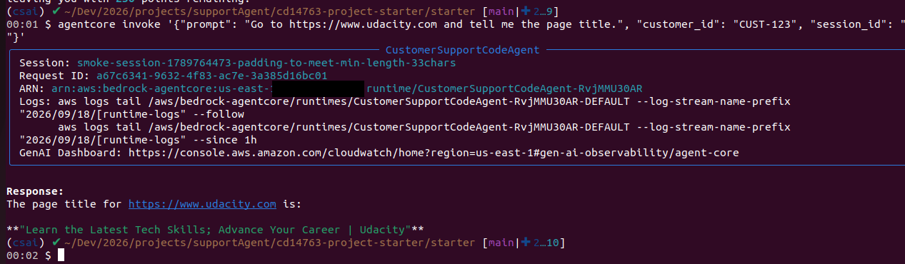

</td>
</tr>
</table>

Typical end-to-end latency in my runs was **~8–12 seconds per scenario** (including tool round-trips and cold starts).

---

## 🔄 How one message flows

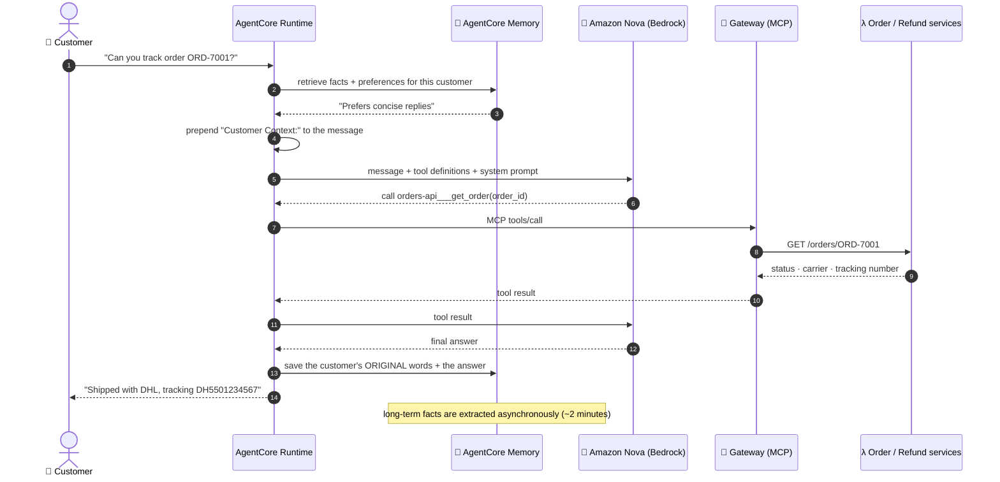

---

## 🧩 The concepts behind it

### 1 · 🔌 Tools over the Model Context Protocol (MCP)
Order lookups and refunds live behind an **AgentCore Gateway**, which exposes an API Gateway REST API and a Lambda
function as MCP tools with one connection. The agent discovers tools at request time (`tools/list`), so adding a
backend means adding a Gateway target — **not** changing agent code.

### 2 · 📚 Retrieval-augmented generation with a managed Knowledge Base
Policy and product questions go to `search_knowledge_base`, which calls the Bedrock **Retrieve** API and returns the
top passages joined with `---`. A guard clause returns a descriptive message if `KNOWLEDGE_BASE_ID` is missing or blank,
instead of failing silently.

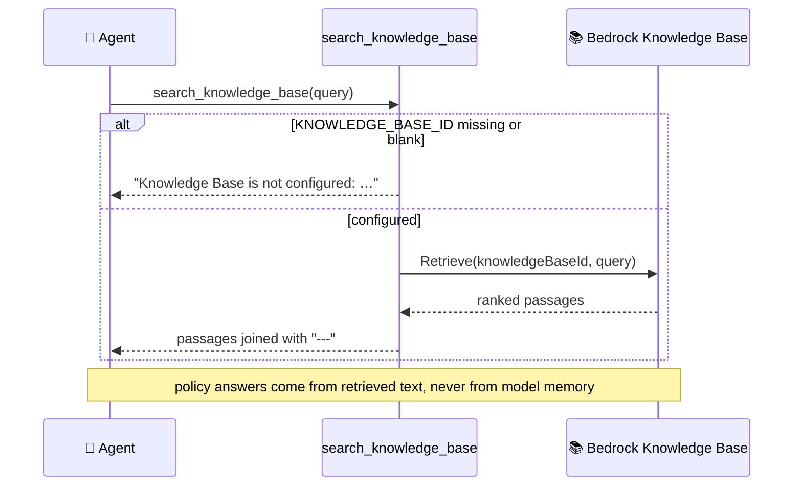

### 3 · 🧬 Cross-session memory (read path and write path)
Two AgentCore Memory strategies — **semantic** (facts) and **user preference** — give each customer a persistent
profile. Before the model runs, relevant memories are injected; after the reply, the turn is saved. A subtle
detail: the hook remembers the exact context block it injected and **strips it before saving**, so the agent's own
recalled notes are never stored as if the customer had said them.

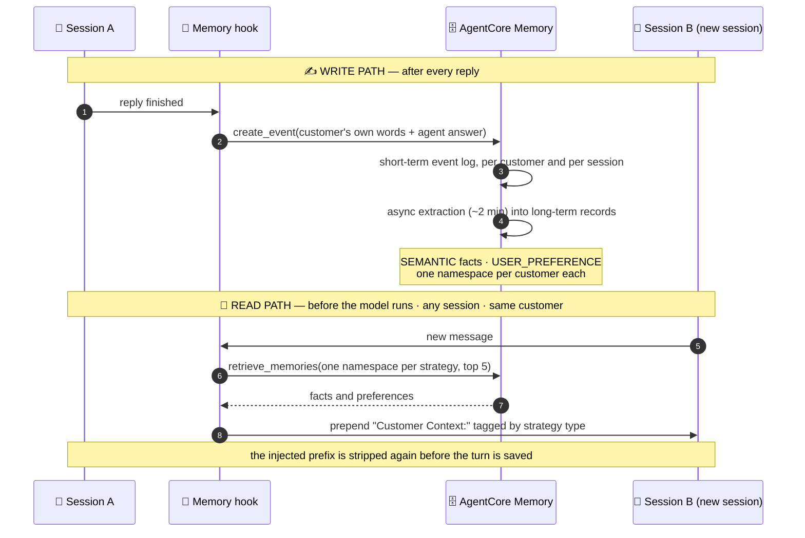

### 4 · 🧮 Exact arithmetic in a sandbox — one source of truth
LLMs are unreliable at arithmetic, so loyalty maths never runs in the model. The rules live in **one block of
Python** that is sent to the AgentCore **Code Interpreter**; the *same text* is executed by the tests, and a parity test
compares both across **384 input combinations** so they cannot drift. If the sandbox is down, a tier-only fallback answers.
Arguments are embedded as literals, so a hostile "tier" string is treated as data, never as code.

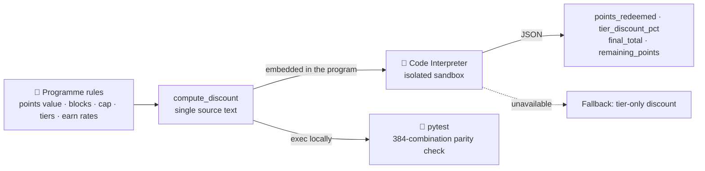

### 5 · 🛡️ Graceful degradation — backends fail, conversations don't
If the Gateway can't be reached (timeout, refused connection, anything else), the failure is logged **with its
traceback**, and the agent carries on with its local tools. Its system prompt is switched so it *tells the customer*
that order and refund lookups are temporarily unavailable, suggests a next step, and refuses to guess.

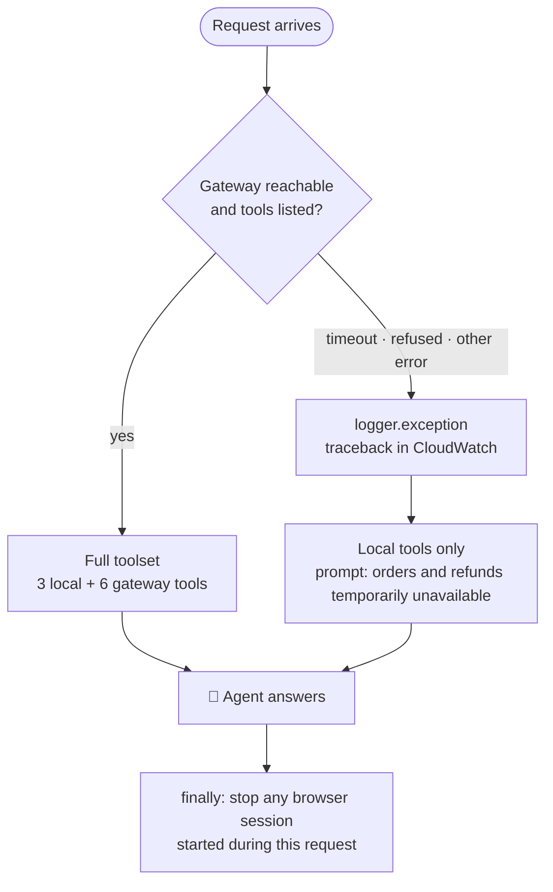

### 6 · 🌍 Browser sessions that do not leak
The strands browser tool opens a remote browser session but never stops it, so each one would stay billable until
its timeout. After every request the handler stops any session started during that request (and sets a 5-minute
timeout as a backstop).

### 7 · 📈 Observability
Every tool call emits one JSON line (tool name, status, duration) that CloudWatch Logs Insights can query; a metric
filter on `ERROR` feeds an alarm (more than 5 errors in 5 minutes).

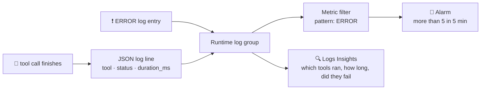

<div align="center">
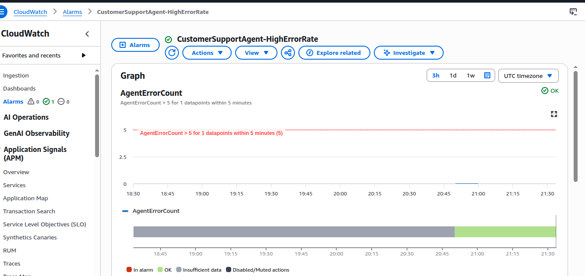
</div>

---

## 🔐 Security model — least-privilege IAM roles

Each component assumes its **own** role, scoped to the specific resource it needs. Full policies and trust
relationships: [`docs/iam-roles.md`](docs/iam-roles.md).

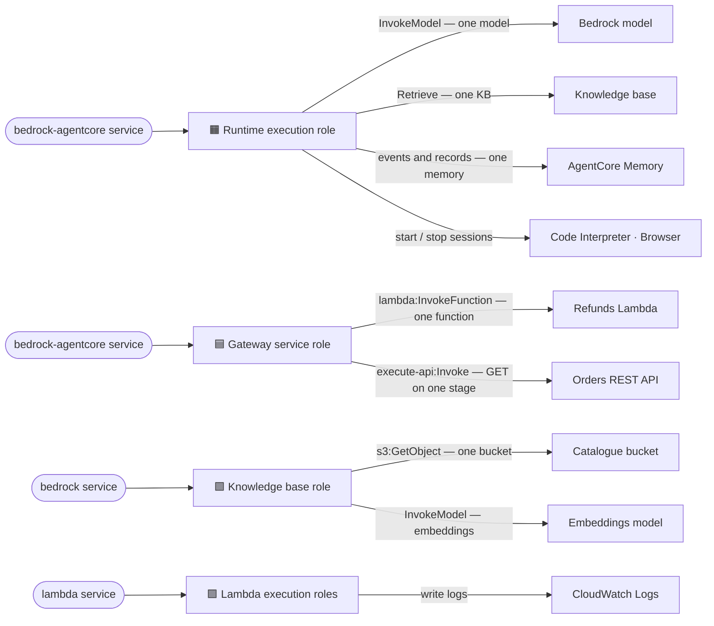

---

## ⚖️ Design decisions and trade-offs

| Decision | Why | Trade-off |
|---|---|---|
| **Managed Knowledge Base** instead of self-managed OpenSearch Serverless | The lab account denied `aoss:*`; a managed KB needs no vector-store infrastructure | Less control over indexing and chunking |
| **Direct code deploy** (Python 3.13) instead of container builds | Container builds were blocked in the account; direct deploy needs no Docker or CodeBuild | Dependencies are cross-built and zipped (~100 MB package) |
| **Rules as one source text**, executed in the sandbox and in tests | The tested logic *is* the deployed logic | The sandbox program is generated code, so it needs the parity test |
| **Memory as best-effort** (errors logged, never raised) | A memory outage must not stop a customer getting an order status | A failed save is silent to the user (visible in logs) |
| **Degrade, don't fail**, when the Gateway is down | Customers still get policy answers and calculations, plus an honest message | The model must be trusted to follow the "unavailable" instruction |
| **Gateway with no authorizer** in the demo | The reference client sends no credentials; fine for mock data in a sandbox | **Not for production** — see the roadmap |
| **Configuration by environment variables** | Same code in any account; no resource IDs in the repo | One more thing to set at deploy time |

---

## ✅ What was verified where

| Capability | Live deployment (AgentCore Runtime) | Offline test suite (this repo) |
|---|:-:|:-:|
| Order tracking via Gateway (API target) | ✅ | ✅ backend routes |
| Refunds via Gateway (Lambda target) | ✅ | ✅ backend rules |
| Knowledge-base retrieval and guard clause | ✅ | ✅ |
| Cross-session memory (two sessions) | ✅ | ✅ hook logic |
| Loyalty maths in the Code Interpreter | ✅ | ✅ + sandbox/local parity |
| Browser tool and session cleanup | ✅ | ✅ cleanup path |
| CloudWatch error alarm | ✅ | — |
| Gateway-down degraded mode | — | ✅ (including the real MCP client against an unreachable host) |
| Tool-call tracing, env-var configuration | — | ✅ |

The screenshots come from the deployment that passed the course assessment (an earlier iteration wired to that
course's sample data). This repository is a clean rewrite with its own module structure, mock backends and sample
data, and it has **not** been redeployed since; its behaviour is covered by the offline suite below.

---

## 🧪 Testing — 70 offline tests, no AWS access needed

```bash
uv sync                # Python 3.13
uv run pytest -q       # 70 passed in ~4 s
uv run ruff check .    # lint
```

| Area | What is proven |
|---|---|
| Loyalty tool | hand-computed cases for every tier and category · sandbox program ≡ local calculation over 384 combinations · hostile input stays data · fallback on error, empty and unparseable results · invalid input never reaches the sandbox |
| Knowledge base | guard clause for empty / blank / `None` · Retrieve arguments · chunk joining · no-results and API-error messages |
| Memory | namespace resolution (`namespaceTemplates` and legacy `namespaces`) · context injection · original words saved · tool results ignored · failures swallowed · hook registration |
| Gateway | success logging · timeout / refused / other errors logged with traceback · client always closed · real MCP client against an unreachable host |
| Handler | tool wiring · degraded prompt · optional memory · graceful error reply · browser cleanup on every path |
| Backends | order routes and errors · refund eligibility · refund-status round trip · tool schema matches implementation |

Tests install dummy credentials and an empty AWS config **before** any client is created, so a test can never
reach real AWS by accident.

---

## 🗂️ Repository map

```text
.
├── main.py                     # AgentCore Runtime entrypoint (@app.entrypoint, app.run)
├── support_agent/
│   ├── config.py               # settings from environment variables
│   ├── handler.py              # builds the agent for one request, cleans up after
│   ├── prompts.py              # system prompt (+ degraded-mode variant)
│   ├── memory.py               # CustomerMemoryHook + namespace resolution
│   ├── gateway.py              # MCP connection that degrades instead of raising
│   ├── tracing.py              # structured tool-call logging
│   ├── browser.py              # browser-session cleanup
│   └── tools/
│       ├── knowledge_base.py   # RAG tool
│       └── loyalty.py          # sandboxed calculation + fallback
├── backends/                   # sample order + refund services (Lambda handlers)
├── data/catalog.md             # knowledge-base content
├── tests/                      # 70 offline tests
├── docs/
│   ├── architecture.md         # every diagram, component responsibilities, failure matrix
│   ├── iam-roles.md            # each role: trust policy, permissions, rationale
│   ├── deployment.md           # how to stand it up, and the sandbox pitfalls I hit
│   ├── diagrams/               # PNG exports of the key diagrams (slides, posts)
│   └── evidence/               # deployment screenshots (account ids redacted)
├── .env.example                # configuration template
└── .github/workflows/ci.yml    # lint + tests on every push
```

---

## 🚀 Run it

```bash
cp .env.example .env            # fill in your own resource ids
uv sync --group deploy
uv run pytest -q                # offline, safe anywhere
```

Deploying needs your own AWS account, a Gateway, a Knowledge Base and a Memory resource. The step-by-step guide,
the role definitions and a verification checklist are in [`docs/deployment.md`](docs/deployment.md).

## 🛣️ Production roadmap

- **Authentication and authorisation:** replace the open demo Gateway with JWT/IAM auth and pass the caller's identity to the tools. **Ownership checks belong in the tools**, not the prompt — during testing the sample agent refunded an order that belonged to another customer, because nothing enforced ownership.
- **Real backends:** swap the mock services for real order and refund systems, with idempotent refunds and human approval above a threshold.
- **Guardrails and evaluation:** Bedrock Guardrails for PII, and a regression suite of scored conversations run in CI.
- **Operations:** latency and tool-failure alarms (not only `ERROR` counts), dashboards, budgets, and automated deployment.

## 🧰 Skills demonstrated

| Area | Where to look |
|---|---|
| Agent runtime deployment (Amazon Bedrock AgentCore) | `main.py`, `docs/deployment.md` |
| Tool integration with MCP, API-based and Lambda-based targets | `support_agent/gateway.py`, `backends/` |
| Retrieval-augmented generation | `support_agent/tools/knowledge_base.py` |
| Persistent, cross-session memory | `support_agent/memory.py` |
| Safe code execution and testable business rules | `support_agent/tools/loyalty.py`, `tests/test_loyalty.py` |
| Resilience and failure handling | `support_agent/gateway.py`, `support_agent/handler.py` |
| Least-privilege IAM design | `docs/iam-roles.md` |
| Observability | `support_agent/tracing.py`, CloudWatch alarm |
| Testing and CI | `tests/`, `.github/workflows/ci.yml` |

---

<div align="center">

Built by **Mahmoud** ([@mahmoudnasser1561](https://github.com/mahmoudnasser1561)) · MIT licensed

</div>
