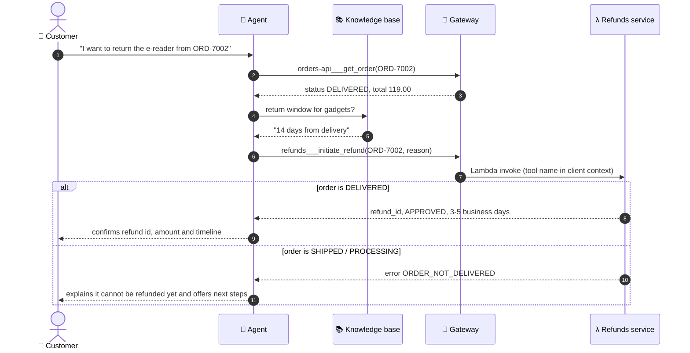
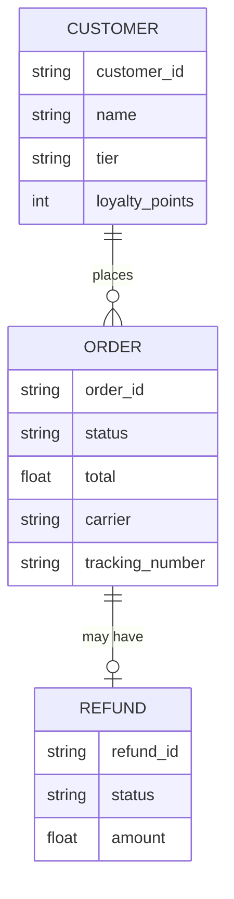
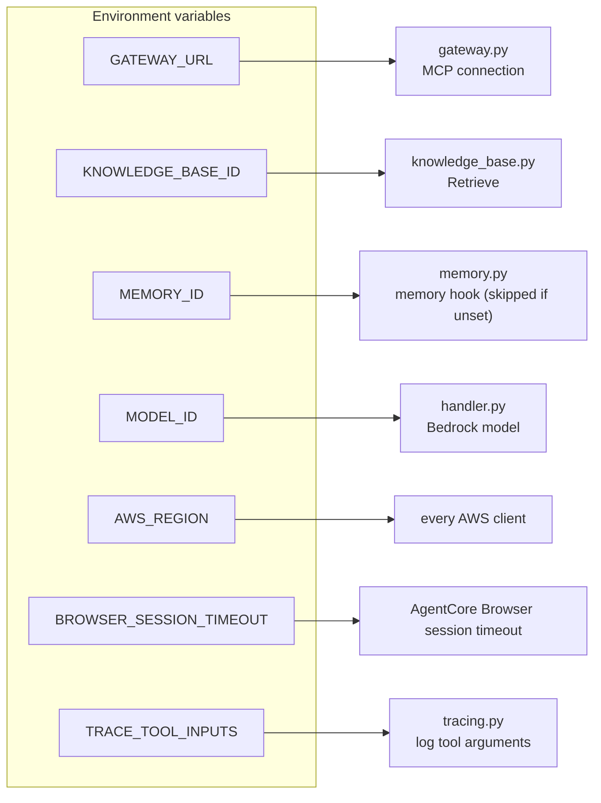

# Architecture

This page goes deeper than the README: who is responsible for what, the flows that are not obvious, what the
sample data looks like, and exactly how each failure shows up for the customer and in the logs.

## Components and responsibilities

| Component | Responsibility | Code |
|---|---|---|
| **AgentCore Runtime** | Hosts the agent; one `invoke` per customer message | `main.py` |
| **Request handler** | Builds the agent for one request, wires hooks and tools, always cleans up | `support_agent/handler.py` |
| **System prompt** | Tells the model which tool to use for what, and forbids guessing | `support_agent/prompts.py` |
| **Memory hook** | Recalls customer context before the model runs, saves the turn after | `support_agent/memory.py` |
| **Gateway connection** | Connects over MCP, lists tools, degrades instead of raising | `support_agent/gateway.py` |
| **Knowledge-base tool** | Retrieve API → passages | `support_agent/tools/knowledge_base.py` |
| **Loyalty tool** | Business rules executed in the Code Interpreter, with a fallback | `support_agent/tools/loyalty.py` |
| **Browser cleanup** | Stops browser sessions the request started | `support_agent/browser.py` |
| **Tool tracing** | One JSON log line per tool call | `support_agent/tracing.py` |
| **Order / refund services** | Sample backends behind the Gateway | `backends/` |

## Deployment pipeline

```mermaid
flowchart LR
    A["✍️ Code + tests"] --> B["uv sync<br/>Python 3.13"]
    B --> C["🧪 pytest + ruff<br/>offline"]
    C --> D["agentcore configure<br/>direct_code_deploy · PYTHON_3_13"]
    D --> E["agentcore deploy<br/>cross-build deps for ARM64 → zip"]
    E --> F["📦 S3 deployment package"]
    F --> G["☁️ AgentCore Runtime<br/>+ DEFAULT endpoint"]
    G --> H["🔐 Attach runtime permissions<br/>(memory · browser · code interpreter · KB · model)"]
    H --> I["🧪 Smoke test each capability<br/>agentcore invoke"]
    I --> J["📊 Metric filter + alarm on ERROR"]
```

## Refund flow — including the rejection path

## Sample data model

Refund ids are derived from the order id (`REF-` + hash), so the sample service needs no database and a refund can
be looked up again later.

## Configuration map

Missing settings never crash the agent: an unset `GATEWAY_URL` means degraded mode, an unset `KNOWLEDGE_BASE_ID`
returns a descriptive message, and an unset `MEMORY_ID` simply skips memory. Each is logged as a warning.

## Failure matrix

| What fails | What the customer experiences | What is logged |
|---|---|---|
| Gateway unreachable, times out or errors | Policy answers and calculations still work; orders and refunds get an honest "temporarily unavailable" message | `Gateway connection failed` / `Gateway tool loading timed out` / `Gateway tool loading failed` with traceback |
| `KNOWLEDGE_BASE_ID` missing or blank | The agent relays that the knowledge base is not configured | warning at request start |
| Knowledge-base API error | "The knowledge base is temporarily unavailable." | `Knowledge base search failed` |
| Code Interpreter unavailable | A tier-only estimate, clearly flagged as such (`computed_by: fallback_tier_only`) | `Code Interpreter unavailable, using tier-only fallback` |
| Memory retrieval error | Works, without personalisation | `Memory retrieval failed` |
| Memory save error | Nothing visible | `Memory save failed` |
| Browser session cleanup error | Nothing visible; the 5-minute session timeout is the backstop | `Browser session cleanup failed` |
| Anything unexpected in the request | A polite apology and a request to try again | `Agent invocation failed` with traceback |

## Why these boundaries

- **The model decides *what* to ask; the systems decide *the answer*.** Prices, policies, order states, refunds and
  arithmetic are never produced by the model.
- **Everything optional degrades.** Memory, the Gateway, the sandbox and the knowledge base can each be missing or
  down without taking the conversation with them.
- **Identity is data, not prompt.** The customer id travels as a request field into memory namespaces and the system
  prompt; see the production roadmap in the README for the ownership-check gap this leaves.
