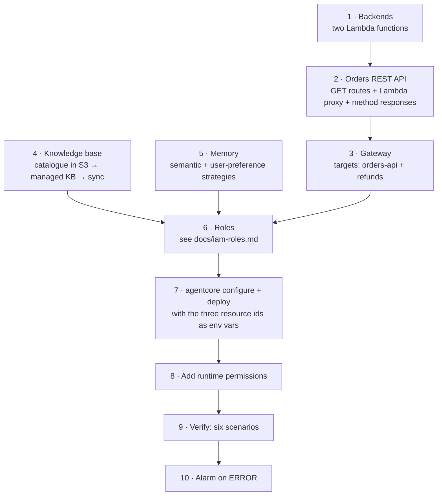

# Deployment guide

This is **guidance, not a template**: it lists what to create, in what order, with the settings that matter. There is
deliberately no infrastructure-as-code here. It is based on the deployment I ran for the assessed iteration of this
agent; the environment-variable wiring described below matches this repository's layout but has not been re-run.

## What you will need

- An AWS account with **Amazon Bedrock model access** for the model in `MODEL_ID` and for Titan Text Embeddings v2
- Python 3.13, [uv](https://docs.astral.sh/uv/), AWS CLI v2
- The deploy tooling: `uv sync --group deploy` (provides the `agentcore` CLI)

## Order of work



### 1 · Backends
Create two Python 3.12 Lambda functions from `backends/orders_service.py` and `backends/refunds_service.py`
(handler `<file name without .py>.lambda_handler`, basic execution role).

### 2 · Orders REST API
Create a REST API with three `GET` methods, each a **Lambda proxy** integration to the orders function. The path
parameter names must be exactly `order_id` and `customer_id` — the handler matches on the resource template.

| Route | Operation name (becomes the MCP tool name) |
|---|---|
| `GET /orders/{order_id}` | `get_order` |
| `GET /customers/{customer_id}/orders` | `get_customer_orders` |
| `GET /customers/{customer_id}` | `get_customer` |

**Declare `200` and `404` method responses on every method**, then deploy a stage. The Gateway reads the stage's
OpenAPI export and rejects methods without declared responses (see the pitfalls table).

### 3 · Gateway
Create an AgentCore Gateway and two targets:

| Target name | Type | Notes |
|---|---|---|
| `orders-api` | API Gateway stage | Filter the three `GET` paths. Outbound credentials: the Gateway's IAM role |
| `refunds` | Lambda | Tool schema: `backends/refund_tool_schema.json` |

Tools are exposed as `<target>___<tool>` (for example `orders-api___get_order`). Copy the Gateway's `/mcp` URL into
`GATEWAY_URL`. The demo uses no authorizer so the reference client needs no token — **do not do that in production**.

### 4 · Knowledge base
Upload `data/catalog.md` to an S3 bucket and create a **managed** Bedrock Knowledge Base (Titan Text Embeddings v2) with
that bucket as an S3 data source. Sync it and test a query such as *"What is the return policy for gadgets?"*
(expected: 14 days). Put the KB id in `KNOWLEDGE_BASE_ID`.

### 5 · Memory
Create an AgentCore Memory resource with two strategies:

| Strategy | Name | Namespace |
|---|---|---|
| Semantic | `customer_facts` | `cs_agent/{actorId}/facts` |
| User preference | `customer_preferences` | `cs_agent/{actorId}/preferences` |

Put the memory id in `MEMORY_ID`.

### 6 · Roles
Create the roles in [`iam-roles.md`](iam-roles.md).

### 7 · Configure and deploy

```bash
uv sync --group deploy
source .venv/bin/activate

agentcore configure \
  --entrypoint main.py \
  --name CustomerSupportAgent \
  --region us-east-1 \
  --deployment-type direct_code_deploy \
  --runtime PYTHON_3_13 \
  --disable-memory \
  --non-interactive

agentcore deploy \
  --env GATEWAY_URL="https://<gateway-id>.gateway.bedrock-agentcore.us-east-1.amazonaws.com/mcp" \
  --env KNOWLEDGE_BASE_ID="<kb-id>" \
  --env MEMORY_ID="<memory-id>"
```

- `--disable-memory` stops the toolkit creating a second, unused memory resource.
- Direct code deploy cross-builds the dependencies for ARM64 and uploads a zip (about 100 MB); it needs no Docker.
- Check `agentcore deploy --help` for how your toolkit version takes several `--env` values.

### 8 · Runtime permissions
The toolkit-created runtime role lacks the memory, browser, code-interpreter, knowledge-base and model permissions.
Attach the inline policy from [`iam-roles.md`](iam-roles.md#1--runtime-execution-role). IAM changes can take a minute
to reach a running session — if the first call still fails, retry with a fresh session id.

### 9 · Verify — six scenarios

```bash
agentcore invoke '{"prompt": "Can you track order ORD-7001?", "customer_id": "CUS-2001", "session_id": "t1"}'
agentcore invoke '{"prompt": "I want to return my Nimbus E-Reader from ORD-7002. Please refund it.", "customer_id": "CUS-2001", "session_id": "t2"}'
agentcore invoke '{"prompt": "What are the benefits of the Platinum loyalty tier?", "customer_id": "CUS-2001", "session_id": "t3"}'
agentcore invoke '{"prompt": "Hi, I am Maya. I prefer concise answers.", "customer_id": "CUS-2001", "session_id": "s-A"}'
# wait 2–3 minutes for long-term extraction, then a NEW session for the same customer:
agentcore invoke '{"prompt": "Do you remember my name and how I like answers?", "customer_id": "CUS-2001", "session_id": "s-B"}'
agentcore invoke '{"prompt": "I am a Gold member with 5400 points. Calculate my discount on a $150 standard order.", "customer_id": "CUS-2001", "session_id": "t5"}'
agentcore invoke '{"prompt": "Go to https://example.com and tell me the page title.", "customer_id": "CUS-2001", "session_id": "t6"}'
```

| Scenario | Expected |
|---|---|
| Track ORD-7001 | shipped, DHL, tracking `DH5501234567`, estimated delivery date |
| Refund ORD-7002 | refund id `REF-…`, APPROVED, 3-5 business days |
| Platinum benefits | free same-day shipping, 12% discount, priority support |
| Memory (session B) | recalls the name and the preference for concise answers |
| Loyalty maths | 3,000 points redeemed, 8% tier discount, final total $82.80, 2,400 points remaining |
| Browser | page title "Example Domain" |

After the browser scenario, check that **no browser session is left open** (`list_browser_sessions` with status `READY`).

### 10 · Alarm on errors
Add a **metric filter** with pattern `ERROR` on the runtime's log group
(`/aws/bedrock-agentcore/runtimes/<agent-id>-DEFAULT`), then a CloudWatch **alarm**: `Sum` of that metric `> 5` over a
`300`-second period, treating missing data as not breaching. For tool-level questions, query the trace lines in
Logs Insights:

```text
fields @timestamp, tool, status, duration_ms
| filter event = "tool_call"
| stats count() as calls, avg(duration_ms) as avg_ms by tool, status
```

## Pitfalls I hit (symptom → cause → fix)

| Symptom | Cause | Fix |
|---|---|---|
| `AccessDenied … aoss:CreateSecurityPolicy` creating a knowledge base | The account cannot create OpenSearch Serverless collections | Create a **managed** knowledge base (no vector-store choice) |
| Container build stops after a few seconds with an empty log | Container builds were blocked in the account | `--deployment-type direct_code_deploy --runtime PYTHON_3_13` |
| Deploy fails: Python version | `requires-python` above what direct deploy supports (3.13 max) | Set `requires-python = ">=3.13"` |
| Runtime crashes on import | `strands_tools.browser` imports `nest_asyncio` without declaring it | Add `nest-asyncio` to dependencies (already done here) |
| Gateway target `FAILED`: "responses is missing" | The REST API methods declare no responses | Add `200` and `404` method responses and redeploy the stage |
| First deployed call returns the generic apology | The runtime role lacks permissions | Read the runtime log group for the `AccessDeniedException`; add that action on that resource |
| Right after a permission fix, still denied | IAM propagation / cached credentials in a warm session | Wait a minute and use a new session id |
| Everything is "not authorized" after a lab restart | Old credentials were revoked by the lab | Use fresh credentials; verify with a **real** API call — `sts get-caller-identity` succeeds even for revoked keys |
| A browser session stays open | The browser tool never stops its session | Handled per request in `support_agent/browser.py`; keep the 5-minute timeout |

## Cost and clean-up

Nothing here bills while idle apart from small storage (S3 objects, container/package artifacts, log groups). The
runtime charges per use, and browser and Code Interpreter sessions per second while open. To tear down, delete in
dependency order: **runtime → Gateway targets → Gateway → knowledge-base data source → knowledge base → memory →
REST API → Lambdas → roles → S3 bucket → log groups**, then confirm no browser sessions remain.
