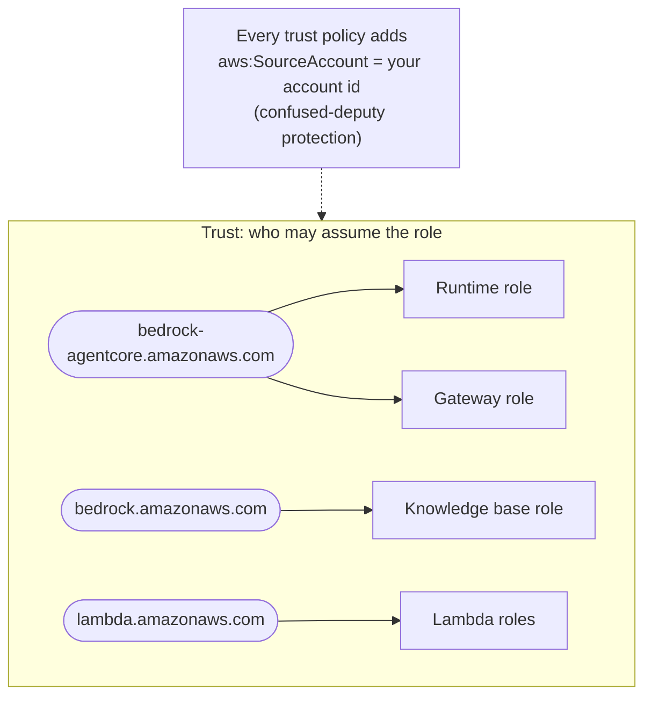

# IAM roles — least privilege, role by role

Each component assumes its own role and is granted only what it uses, scoped to specific resources. Replace the
`<PLACEHOLDERS>` with your own values. These are **guidance snippets**, not a deployable template.

| Role | Assumed by | Can do | Scoped to |
|---|---|---|---|
| Runtime execution role | `bedrock-agentcore` service | invoke the model, retrieve from the KB, read/write memory, use Code Interpreter and Browser | one model, one KB, one memory |
| Gateway service role | `bedrock-agentcore` service | invoke the refunds Lambda, call the orders API | one function, `GET` on one API stage |
| Knowledge-base role | `bedrock` service | read the catalogue bucket, invoke the embeddings model | one bucket, one model |
| Lambda execution roles | `lambda` service | write logs | — |



## 1 · Runtime execution role

The AgentCore toolkit creates a base role (logs, tracing, image/package access, workload identity). It does **not**
include the permissions below — I found that out when the first deployed call returned my generic error message and
the runtime logs showed `AccessDeniedException` for `GetMemory`. Add them as an inline policy.

```json
{
  "Version": "2012-10-17",
  "Statement": [
    {
      "Sid": "ModelInvoke",
      "Effect": "Allow",
      "Action": ["bedrock:InvokeModel", "bedrock:InvokeModelWithResponseStream"],
      "Resource": [
        "arn:aws:bedrock:*::foundation-model/<MODEL_ID>",
        "arn:aws:bedrock:<REGION>:<ACCOUNT_ID>:inference-profile/<INFERENCE_PROFILE_ID>"
      ]
    },
    {
      "Sid": "KnowledgeBaseRetrieve",
      "Effect": "Allow",
      "Action": "bedrock:Retrieve",
      "Resource": "arn:aws:bedrock:<REGION>:<ACCOUNT_ID>:knowledge-base/<KNOWLEDGE_BASE_ID>"
    },
    {
      "Sid": "ProjectMemory",
      "Effect": "Allow",
      "Action": [
        "bedrock-agentcore:GetMemory",
        "bedrock-agentcore:CreateEvent",
        "bedrock-agentcore:GetEvent",
        "bedrock-agentcore:ListEvents",
        "bedrock-agentcore:RetrieveMemoryRecords",
        "bedrock-agentcore:ListMemoryRecords",
        "bedrock-agentcore:GetMemoryRecord"
      ],
      "Resource": "arn:aws:bedrock-agentcore:<REGION>:<ACCOUNT_ID>:memory/<MEMORY_ID>"
    },
    {
      "Sid": "CodeInterpreterTool",
      "Effect": "Allow",
      "Action": [
        "bedrock-agentcore:StartCodeInterpreterSession",
        "bedrock-agentcore:InvokeCodeInterpreter",
        "bedrock-agentcore:StopCodeInterpreterSession",
        "bedrock-agentcore:GetCodeInterpreterSession"
      ],
      "Resource": "arn:aws:bedrock-agentcore:<REGION>:aws:code-interpreter/*"
    },
    {
      "Sid": "BrowserTool",
      "Effect": "Allow",
      "Action": [
        "bedrock-agentcore:StartBrowserSession",
        "bedrock-agentcore:StopBrowserSession",
        "bedrock-agentcore:GetBrowserSession",
        "bedrock-agentcore:ListBrowserSessions",
        "bedrock-agentcore:ConnectBrowserAutomationStream",
        "bedrock-agentcore:ConnectBrowserLiveViewStream",
        "bedrock-agentcore:UpdateBrowserStream"
      ],
      "Resource": "arn:aws:bedrock-agentcore:<REGION>:aws:browser/*"
    }
  ]
}
```

Notes:
- `GetMemory` is a **control-plane** action, and it is required because the memory client reads the strategies'
  namespace templates at start of every request.
- `ListBrowserSessions` and `StopBrowserSession` are what the per-request browser cleanup uses. Without them the
  cleanup logs an error and the 5-minute session timeout is the only backstop.
- Data-plane permissions are scoped to **one** memory and **one** knowledge base, not `*`.

## 2 · Gateway service role

```json
{
  "Version": "2012-10-17",
  "Statement": [
    {
      "Sid": "InvokeRefundLambda",
      "Effect": "Allow",
      "Action": "lambda:InvokeFunction",
      "Resource": "arn:aws:lambda:<REGION>:<ACCOUNT_ID>:function:<REFUNDS_FUNCTION_NAME>"
    },
    {
      "Sid": "InvokeOrdersApi",
      "Effect": "Allow",
      "Action": "execute-api:Invoke",
      "Resource": "arn:aws:execute-api:<REGION>:<ACCOUNT_ID>:<REST_API_ID>/<STAGE>/GET/*"
    }
  ]
}
```

Trust policy (the same shape is used for the runtime role):

```json
{
  "Version": "2012-10-17",
  "Statement": [{
    "Effect": "Allow",
    "Principal": { "Service": "bedrock-agentcore.amazonaws.com" },
    "Action": "sts:AssumeRole",
    "Condition": { "StringEquals": { "aws:SourceAccount": "<ACCOUNT_ID>" } }
  }]
}
```

## 3 · Knowledge-base role

```json
{
  "Version": "2012-10-17",
  "Statement": [
    {
      "Sid": "ReadCatalogueBucket",
      "Effect": "Allow",
      "Action": ["s3:GetObject", "s3:ListBucket"],
      "Resource": ["arn:aws:s3:::<BUCKET>", "arn:aws:s3:::<BUCKET>/*"],
      "Condition": { "StringEquals": { "aws:ResourceAccount": "<ACCOUNT_ID>" } }
    },
    {
      "Sid": "InvokeEmbeddingsModel",
      "Effect": "Allow",
      "Action": "bedrock:InvokeModel",
      "Resource": "arn:aws:bedrock:<REGION>::foundation-model/amazon.titan-embed-text-v2:0"
    }
  ]
}
```

Trust policy:

```json
{
  "Version": "2012-10-17",
  "Statement": [{
    "Effect": "Allow",
    "Principal": { "Service": "bedrock.amazonaws.com" },
    "Action": "sts:AssumeRole",
    "Condition": {
      "StringEquals": { "aws:SourceAccount": "<ACCOUNT_ID>" },
      "ArnLike": { "aws:SourceArn": "arn:aws:bedrock:<REGION>:<ACCOUNT_ID>:knowledge-base/*" }
    }
  }]
}
```

## 4 · Lambda execution roles

Attach the AWS-managed `AWSLambdaBasicExecutionRole` (CloudWatch Logs only). The sample services touch no other
AWS service.

## How to check a role does only what you meant

- **Simulate before you deploy:** `aws iam simulate-principal-policy` with the actions you expect to be allowed and a
  few you expect to be denied (`iam:*`, `s3:*`, a different function's ARN).
- **Read the logs after deploy:** an `AccessDeniedException` in the runtime's log group names the exact missing
  action and resource — that is how the missing memory and browser permissions above were found.
- **Never widen to `*` to make an error go away:** add the specific action on the specific resource instead.
